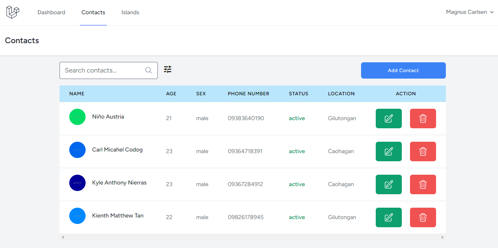
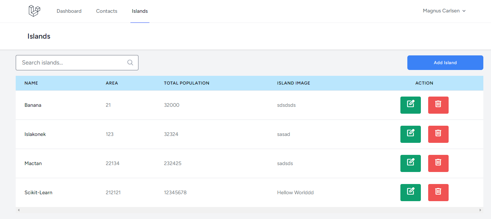

# islakonek
IslaKonek was developed as an individual project for On-The-Job training/Internship to enable the student to learn and utilize Laravel, a robust back-end framework for PHP. It is a straightforward yet powerful contact management system meticulously crafted using the PHP Laravel framework, along with modern CSS frameworks and MySQL as the database. The main objective was to implement CRUD operations to establish a basic foundation for interacting with the database. 

## At this time, only these features are being developed

## CONTACT

## ISLANDS

### I N &nbsp; P R O G R E S S . . .

