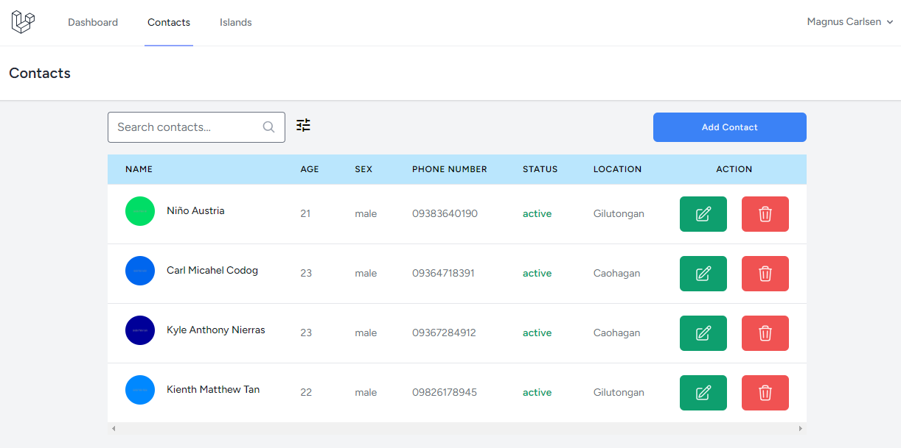
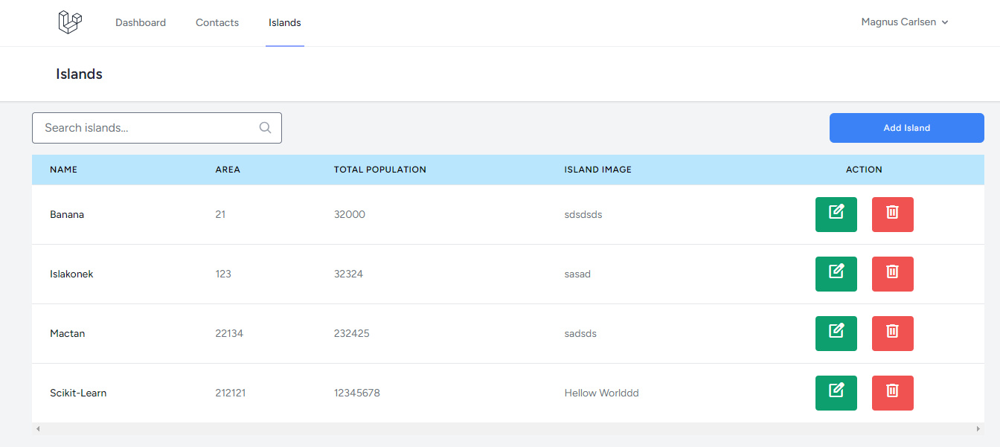

# IslaKonek: Contact Management System

## 📖 About
IslaKonek was developed as an individual project for On-The-Job Training/Internship to enable the student to learn and utilize Laravel, a robust back-end framework for PHP. It is a straightforward yet powerful contact management system meticulously crafted using the PHP Laravel framework, along with Tailwind CSS and MySQL as the database. The main objective was to implement CRUD operations to establish a basic foundation for interacting with the database.

## ✨ Features/Demo

#### CONTACT

#### ISLANDS

### 🚧 I N &nbsp; P R O G R E S S . . .

## 🛠️ Tech Stack
* PHP 8.x  
* Laravel  
* MySQL  
* Tailwind CSS  
* Blade Templating Engine  

## ⚙️ Getting Started
### Prerequisites
* PHP 8.x  
* Composer  
* MySQL  
* Node.js & npm  
### Installation & Run
1. Clone the repository  
   &nbsp;&nbsp; `git clone https://github.com/Nin-Onin/islakonek.git`  
   &nbsp;&nbsp; `cd islakonek`
2. Install PHP dependencies  
   &nbsp;&nbsp; `composer install`
3. Install Node dependencies  
   &nbsp;&nbsp; `npm install`
4. Copy the environment file and configure your database  
   &nbsp;&nbsp; `cp .env.example .env`
5. Configure your database credentials in the `.env` file  
   &nbsp;&nbsp; `DB_DATABASE=your_database_name`  
   &nbsp;&nbsp; `DB_USERNAME=your_username`  
   &nbsp;&nbsp; `DB_PASSWORD=your_password`
6. Generate application key  
   &nbsp;&nbsp; `php artisan key:generate`
7. Run database migrations  
   &nbsp;&nbsp; `php artisan migrate`
8. Build Tailwind CSS assets  
   &nbsp;&nbsp; `npm run dev`
9. Run the application  
   &nbsp;&nbsp; `php artisan serve`
10. Open your browser and go to  
    &nbsp;&nbsp; `http://127.0.0.1:8000`

## 🚀 Usage
1. Navigate to the **Contact** menu to manage contacts using CRUD operations.
2. Navigate to the **Islands** menu to manage island records using CRUD operations.
3. More features are currently under development.

## 👤 Author
**Niño M. Austria**
- GitHub: [@Nin-Onin](https://github.com/Nin-Onin)
